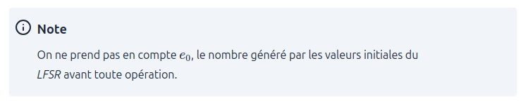
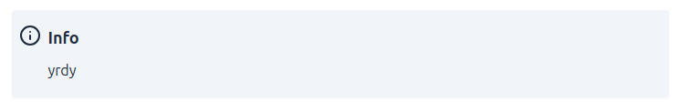
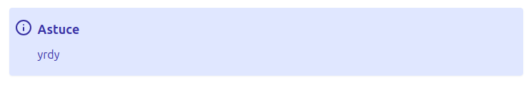
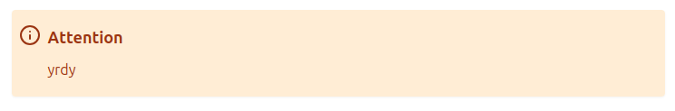
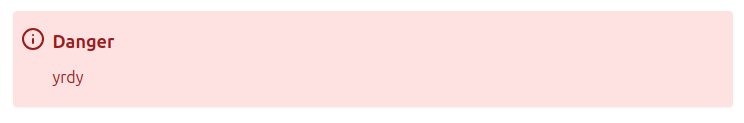
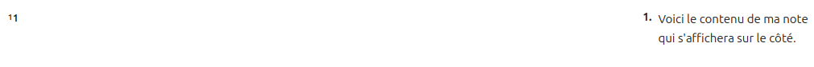

# Blog

## Important

Le blog ne peut être utilisé qu'avec des versions de `Hugo` supérieures ou égales à `0.140`.

## Git clone

Le site utilise un theme `Hugo` personnalisé. Pour cloner le dépôt, utilisez la commande suivante :

```bash
git clone --recurse ...
```

## Note :

### Note d'admonition



```

...

```

### Info d'admonition



```

...

```

### Tip d'admonition



```

...

```

### Warning d'admonition



```

...

```

### Danger d'admonition



```

...

```

### Backlink

Permet d'ajouter un lien vers un autre article.

```

```

### SideNote



```
Voici le contenu de ma note qui s'affichera sur le côté.
```